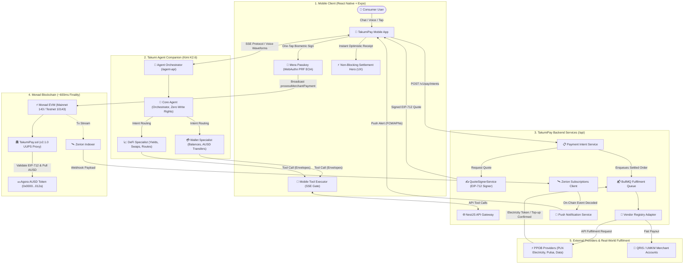

# TakumiPay — Monad Metropolis Hackathon 2026

> **Spend AUSD anywhere in Indonesia with one tap, powered by Monad**  
> *Passkey sign-up with Mera, ~600ms settlement on Monad, and Takumi Agent as a built-in companion that helps you manage your money.*

- **Team:** Planckify Labs
- **Track Entered:** Track 02 — Consumer Products & Payments
- **Technical Demo (3 min):** [Watch on YouTube](https://youtu.be/5kS-HD6G_bo)
- **Live Preview APK (Android):** [Download on Google Drive](https://drive.google.com/file/d/1Z9yxv1afO5y32r0b_qIRSNtPM52lS1RN/view?usp=sharing)
- **Targeted Sponsor Bounties:**
  - **Mera Bounty:** Passkey account layer as the entire onboarding experience (zero seed phrase)
  - **Agora Bounty:** Full on-chain Agora AUSD stablecoin integration
  - **Kimi Bounty:** Takumi Agent, powered by Kimi K2.6, built into the payment experience to check balances and send AUSD from plain-language requests, with every action approved by the user
- **License:** [GNU General Public License v3.0 (GPLv3)](./LICENSE)

> 📱 **Notice for Judges & Testers**: Please install and test the Preview APK on a **physical device** (Android phone with biometric support such as fingerprint or Face Unlock). Mera's passkey key derivation relies on the **WebAuthn PRF (Pseudo-Random Function) extension** and platform biometric authenticators (Google Credential Manager). Android emulators typically lack biometric enrollment and PRF extension support in their virtual Google Play Services environment, which will prevent the passkey onboarding ceremony from completing.

---

## Product at a Glance

TakumiPay is a payments app first. Takumi Agent is the companion that helps people manage their money, inside the same simple experience.

```text
                  TAKUMIPAY
                      │
          ┌───────────┴───────────┐
          │                       │
      PAYMENTS                INTELLIGENCE
          │                       │
    Stablecoins              TakumiAgent
          │                       │
    Real-world use          Financial companion
          │                       │
    QR payments             DeFi / Yield / Strategies
          │                       │
          └───────────┬───────────┘
                      │
              SIMPLE USER EXPERIENCE
                      │
                 "JUST TAP"
```

| Pillar | What it is | In this submission |
|---|---|---|
| **Payments** (the product) | Agora AUSD that people can spend in the real world, not just hold. | Spent on Monad at QRIS merchants and PPOB bills (electricity, pulsa, data) through national QR rails, and sent to family abroad. QRIS merchant spend is verified end-to-end on Monad testnet (see Deployments). |
| **Intelligence** (the companion) | **Takumi Agent** helps users manage their money in plain words. | Powered by Kimi K2.6: checks balances and sends AUSD from a sentence, with every action approved by the user. DeFi and savings guidance is the next step (see Roadmap). |
| **Simple user experience** | Everything above collapses into one gesture. | Passkey sign-up and a biometric tap to pay (Mera), with no seed phrase to write down. |

---

## The Vision

Digital dollars like Agora AUSD are fast, cheap, and stable, yet most people cannot use them where they live:
- **Holding is not spending.** Balances sit idle because merchants and utility bills run on local rails, so users have to off-ramp before they can use their money.
- **Crypto UX gets in the way.** Seed phrases, gas asset confusion, and wallet jargon lose everyday users before the first payment.

TakumiPay removes both problems:
1. **Mera Passkeys:** One-tap biometric sign-up (Face ID / Fingerprint) deriving a secp256k1 EOA via WebAuthn PRF. No seed phrases or recovery phrases ever shown to the user.
2. **Monad Speed & Scale:** ~600ms block finality and sub-cent gas fees make everyday payments instant and affordable.
3. **Agora AUSD:** A dollar stablecoin issued by Agora, backed 1:1 by cash, short-term US Treasuries and overnight repo, with monthly reserve attestations (`0x00000000eFE302BEAA2b3e6e1b18d08D69a9012a`).
4. **Immediate Spendability (QRIS / UMKM):** No off-ramp step. Balances are spent directly at 44M+ merchants across Indonesia via national QR rails.
5. **Sending money home:** The same rails serve migrant workers in Southeast Asia, who today endure 2–5 day settlement delays and 5–10% hidden foreign exchange markups.
6. **Takumi Agent (Kimi K2.6):** A companion built into the app. Users can ask in plain words, such as *"What's my balance?"* or *"Send $50 to my mom in Jakarta"*, and approve each action with a tap.

---

## End-to-End System Architecture

The following diagram illustrates how TakumiPay's payment flow, Takumi Agent companion, backend microservices, Monad smart contracts, and real-world payment rails communicate end-to-end:



### Architectural Highlights

1. **Takumi Agent Specialist Model**:
   - **Core Agent**: Acts strictly as the orchestrator. It manages session context, parses natural-language user intent with Kimi K2.6, and routes tasks to specialized agents without holding write permissions.
   - **Wallet Specialist & DeFi Specialist**: Handle domain-specific capabilities (e.g. `send_token`, `get_wallet_assets`). Tool calls are dispatched over SSE envelopes to the mobile client, enforcing **Wallet Context Isolation** (intents execute against the intent wallet, not the active UI wallet).
2. **End-to-End QRIS & PPOB Bill Settlement**:
   - The user scans a QRIS merchant code or selects a utility bill (PLN electricity token, mobile pulsa/data).
   - The mobile app requests an intent from the backend API, where `QuoteSignerService` issues an EIP-712 cryptographic quote signed by `backendSigner`.
   - The user signs the transaction with their **Mera Passkey (WebAuthn PRF)** via Face ID or fingerprint.
   - The transaction broadcasts to Monad, calling `processMerchantPayment` on `TakumiPay.sol` (v2.1.0 UUPS Proxy), transferring Agora AUSD in ~600ms.
   - The UI immediately renders a non-blocking settlement timeline (`Preparing` → `Confirming` → `Paid`).
3. **PPOB Fulfilment & QRIS Merchant Disbursement**:
   - Once the Monad transaction confirms, `FulfilmentService` routes the settled order through `VendorRegistry` to a PPOB provider to deliver electricity prepaid tokens or mobile pulsa in real-time.
   - For merchant payments, the equivalent fiat amount is disbursed directly to the merchant's local bank or e-wallet account (GoPay, OVO, DANA).
4. **Real-Time Indexing & Push Notifications (Zerion Integration)**:
   - Monad on-chain activity is indexed via Zerion.
   - Zerion webhook subscriptions (`ZerionSubscriptionsClient`) stream decoded transaction events back to TakumiPay's backend, triggering instant push notifications to the user via FCM/APNs.

---

## Repositories & Architecture

All code repositories are open source under the **GNU General Public License v3.0 (GPLv3)** and carry full commit histories:

| Repository | Description | Tech Stack |
|---|---|---|
| [`monad-submission-mobile-app`](https://github.com/Planckify-Labs/monad-submission-mobile-app) | Consumer mobile wallet: biometric passkey onboarding, dedicated Monad rails, non-blocking settlement timeline, Takumi Agent UI | React Native, Expo 54, viem, NativeWind |
| [`monad-submission-contract`](https://github.com/Planckify-Labs/monad-submission-contract) | TakumiPay 2.1.0 UUPS proxy settlement contract, `MockAUSD.sol`, Foundry scripts, and test suites | Solidity, Foundry (EVM) |
| [`monad-submission-api`](https://github.com/Planckify-Labs/monad-submission-api) | Backend API: Monad network & token catalog seeds, EIP-712 merchant quote signing service, intent settlement state machine | NestJS, Prisma, PostgreSQL, Redis |
| [`monad-submission-agent-api`](https://github.com/Planckify-Labs/monad-submission-agent-api) | Takumi Agent service: Kimi K2.6 companion, intent routing, and capability tool execution envelopes | TypeScript, Vercel AI SDK, Moonshot Kimi |

---

## Monad On-Chain Deployments

TakumiPay smart contracts are deployed live on **Monad Mainnet** (real AUSD payment rail) and **Monad Testnet** (merchant-spend verification rail):

### 1. Monad Mainnet (`chainId: 143`) — Production AUSD Rail

| Component | Detail | Address / Hash | Explorer |
|---|---|---|---|
| **TakumiPay Proxy (UUPS)** | Main Treasury & Settlement Contract (v2.1.0) | `0x479B0843C3e0627f36551660506dEd5b349Fa968` | [MonadVision Proxy](https://monadvision.com/address/0x479B0843C3e0627f36551660506dEd5b349Fa968) |
| **Implementation** | `TakumiPay.sol` logic contract | `0x1aC593085Fa34c651E805085da4b2cabAC676F99` | Implementation Logic |
| **Proxy Deploy Tx** | Contract creation | `0x0c50d974055f91c9b093d45026d4ab214f7b0f67e30627976f8bc66f6128f8c7` | Verified broadcast |
| **Implementation Deploy Tx**| Implementation deploy | `0x051d16f8b67b71945231f82550060a565496883a02f95404e5c4152b01f83525` | Verified broadcast |
| **Allowed Token (Agora AUSD)** | Real Agora AUSD (ERC-20, 6 decimals) | `0x00000000eFE302BEAA2b3e6e1b18d08D69a9012a` | [MonadVision AUSD](https://monadvision.com/address/0x00000000eFE302BEAA2b3e6e1b18d08D69a9012a) |
| **Enable AUSD Tx** | `addAllowedPaymentToken` | `0x8d12ec7d42afd22e9f436a0832fb1814ea047f7e7cf9dbcdd7b6feafbc37d0a2` | Configuration step |
| **Backend Signer** | Authorized merchant quote signer | `0x299E4E56e9F05A21414A62479DA1514C20aA61e8` | EIP-712 recovery target |

### 2. Monad Testnet (`chainId: 10143`) — Merchant Spend Verification Rail

| Component | Detail | Address / Hash | Explorer |
|---|---|---|---|
| **TakumiPay Proxy (UUPS)** | Main Treasury & Settlement Contract (v2.1.0) | `0x9EEC5aD4FC092fD468A8114007e541238F4Ba5ee` | [Testnet Explorer](https://testnet.monadvision.com/address/0x9EEC5aD4FC092fD468A8114007e541238F4Ba5ee) |
| **Implementation** | `TakumiPay.sol` logic contract | `0xbB074ED383dA5C99756D72b62f7Fdff97A8c9022` | Implementation Logic |
| **Proxy Deploy Tx** | Contract creation | `0x6eed45f5b5bac2652706f8f7bd765887dd278d8df0a54edd1476f8578b4386d6` | Verified broadcast |
| **Implementation Deploy Tx**| Implementation deploy | `0x76b3f2c44af2fd9ba31cb9d81eb2f79eb316d2effbc5e2d04649c718c3234e0e` | Verified broadcast |
| **Open-Mint MockAUSD** | 6-decimal testnet stand-in (`src/MockAUSD.sol`) | `0x1aC593085Fa34c651E805085da4b2cabAC676F99` | [Testnet MockAUSD](https://testnet.monadvision.com/address/0x1aC593085Fa34c651E805085da4b2cabAC676F99) |
| **MockAUSD Deploy Tx** | Mock contract deployment | `0xdca51260a5709ccbadbd39f86dbd2e7ef6046647d9ff2e3a64882dacf1f4aa01` | Token deploy |

---

## Roadmap: A Companion That Grows With You

Payments are the product. Takumi Agent is where we plan to make that product more helpful over time. **The items below are future development, not part of what this submission ships.**

- **Learn from how you spend, with your consent,** so suggestions fit your own habits instead of generic advice.
- **Help you save (*menabung*).** Spot idle balances and suggest savings and DeFi strategies. The DeFi engine already exists in our codebase.
- **Always suggest, never act alone.** Every move stays a user-approved action, using the same approval layer that protects payments today.

---

## Originality & Hackathon Build Window Disclosure

*(Mandatory disclosure under Section 4.1 Clause 4 of Metropolis Hackathon Rules)*

1. **Pre-Existing Foundation (Before the Hackathon):**
   Foundational mobile UI design system, cryptographic signing utilities, and payment gateway primitives originated prior to the hackathon.
2. **Substantial Work Built During the Hackathon Window:**
   *The entire consumer payments, passkey, and settlement product was engineered specifically for the Monad ecosystem:*
   - **Dedicated Monad Consumer Architecture:** Engineered a streamlined user journey centered exclusively on Monad Mainnet (`143`) and Testnet (`10143`), eliminating network switching, chain dropdowns, and onboarding friction for everyday users.
   - **Mera Passkey Account Layer:** WebAuthn PRF key derivation enabling seedless, biometric Face ID/Fingerprint onboarding tailored for non-crypto consumers.
   - **Monad Network & Agora AUSD Integration:** Configured Monad execution parameters, sub-cent fee handling, and Agora AUSD contract integration.
   - **TakumiPay 2.1.0 Monad Deployments:** Deployed and verified UUPS contracts on Monad Mainnet (`0x479B0843C3e0627f36551660506dEd5b349Fa968`) and Monad Testnet (`0x9EEC5aD4FC092fD468A8114007e541238F4Ba5ee`).
   - **Non-Blocking Settlement UX:** Built a streaming visual settlement hero (`Preparing` → `Confirming` → `Paid`) engineered to take advantage of Monad's ~600ms block finality.
   - **Takumi Agent (Kimi K2.6):** A companion inside the payment app that checks balances and sends AUSD over Monad from plain-language requests, with every action approved by the user.
3. **AI Tools Disclosure:**
   Assisted by Claude (Sonnet/Opus) and Gemini for design synthesis, test generation, and documentation.

---

## Quick Start

```bash
# 1. Mobile App
git clone https://github.com/Planckify-Labs/monad-submission-mobile-app.git
cd monad-submission-mobile-app && pnpm install && pnpm start

# 2. Smart Contracts
git clone https://github.com/Planckify-Labs/monad-submission-contract.git
cd monad-submission-contract/evm && forge test

# 3. Backend API
git clone https://github.com/Planckify-Labs/monad-submission-api.git
cd monad-submission-api && pnpm install && pnpm start:dev

# 4. Agent Orchestrator
git clone https://github.com/Planckify-Labs/monad-submission-agent-api.git
cd monad-submission-agent-api && pnpm install && pnpm dev
```

---

<sub>Built with pride by Planckify Labs for the Monad Metropolis Hackathon, September 2026.</sub>
